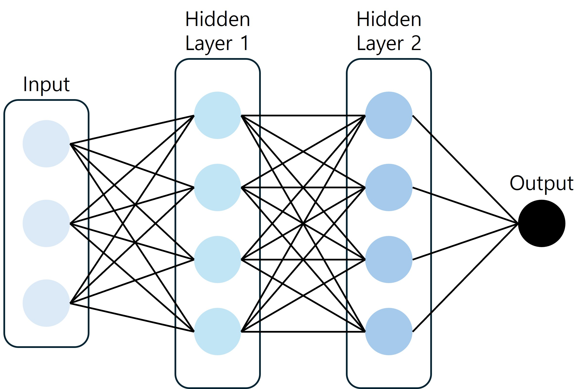

## 1. 인공 신경망 (Artificial Neural Network, ANN)
> 함수를 이용한 근사에 대입하여 설명하면,
**인공 신경망은 어떤 복잡한 관계도 피팅할 수 있는 유연성을 가진 함수**라고 볼 수 있다.

- 이 신경망은 길이가 3인 벡터를 입력으로 받아 값 하나를 리턴하는 함수이다.
- 함수 내부에는 히든 레이어가 두 층이 쌓여 있다.
- 각 히든 레이어는 여러 개의 노드로 구성되어 있다.
- 노드는 해당 노드로 들어오는 값들을 **(1)선형 결합**한 후에 **(2)비선형 함수**를 적용한다.

>**(1)** 히든 레이어에 존재하는 하나의 노드로 들어오는 3개의 값 $(x_1, x_2, x_3)$을 선형 결합하여 $w_1x_1+w_2x_2+w_3x_3+b$의 값을 만든 후,

>**(2)** 이 값에 $g(x)$라는 비선형 함수를 통과시킨다.$$g(w_1x_1+w_2x_2+w_3x_3+b)$$

#### (1) 선형 결합 (Linear Combination)
> 피처(Feature)를 만드는 과정

인풋 벡터보다 한층 더 추상화된 피쳐를 계산하여 스스로 신경망의 파라미터들이 알맞은 값으로 학습하게 된다.

#### (2) 비선형 함수 (Non-Linear Activation)
> 입력과 출력의 관계가 비선형 관계일 수 있기 때문에 필요한 함수

## 2. 신경망의 학습 :: 그라디언트 디센트

그라디언트를 계산하여 파라미터를 업데이트하는 방식으로 목적 함수를 최소화 해나가는 과정

#### ① 손실 함수 (Loss Function)
$$L(w)$$
- 뉴럴넷의 아웃풋이 주어진 데이터로부터 틀린 정도를 나타내는 함수
- 우리의 목표는 손실 함수의 값이 줄어들도록 노드와 연결되는 파라미터인 $w$를 수정하는 것이다.
- 손실 함수를 $w$에 대해 미분하면 그것은 곧 **$w$가 손실 함수에 미치는 영향력**이다. (미분 값이 클수록 해당 파라미터의 영향력이 크다고 볼 수 있음)
- 영향력이 큰 파라미터는 많이 바꿔주고,
- 영향력이 작은 파라미터는 조금 바꿔줘서 효율적으로 손실 함수의 값을 바꿔주는 것이 중요하다.

> 무수히 많은 파라미터에 대해 편미분(Partial Derivative) 과정을 거치게 되면 아래와 같은 형태가 된다.  $$\nabla_wL(w)=(\frac{\partial L(w)}{\partial w_1}, \frac{\partial L(w)}{\partial w_2}, ..., \frac{\partial L(w)}{\partial w_n})$$

> 그라디언트 $(\nabla)$를 계산했다면, 파라미터 $w$를 그라디언트 방향으로 아주 조금씩 이동시켜주면 된다.

#### ② 러닝 레이트 (Learning Rate) :: $\alpha$
- 업데이트 크기를 결정하는 상수 (파라미터 $w$를 얼만큼 이동시킬지 결정함) 
> $$w'=w-\alpha*\nabla_w L(w)$$