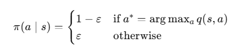

# 몬테카를로 컨트롤
> MDP(보상이나 전이 확률)를 모를 때 최고의 정책을 찾을 수 있는 control 방식 중 하나

## 1. 정책 이터레이션 사용 불가
- 반복적 정책 평가를 사용할 수 없다.
> 반복적 정책 평가는 **벨만 기대 방정식(MDP에 대한 정보가 필요)** 을 기반으로 한다.
$$v_\pi(s)=\sum_{a \in A}\pi(a | s) [r_s^a+\gamma \sum_{s' \in S}P_{ss'}^a v_\pi(s')]$$
- 정책 개선 단계에서 그리디 정책을 만들 수 없다.
> 행동에 대한 다음 상태에 대한 정보가 없기 때문에 행동의 우열을 판단하지 못한다.

## 2. 정책 이터레이션 해결 방법
#### 1. 정책 평가 단계에서 몬테카를로 방법론을 적용하여 각 상태의 밸류를 평가
#### 2. 상태 가치 함수가 아닌 상태-액션 가치 함수 $q(s,a)$를 활용하는 방법
- 행동을 하면 어떤 상태로 도달하는지는 모르지만, 밸류를 알 수 있다.
- 행동의 결과로 밸류를 알게 된다면 밸류가 제일 높은 행동을 선택할 수 있다.

> **[ 핵심 ]**\
몬테카를로 방법론을 통해 상태-액션 가치 함수를 구하는 것   
그 외에는 이터레이션의 방법론을 그대로 따름   
\
**(1)** 평가된 상태-액션 가치 함수를 통해 그리디 정책을 만든다.   
**(2)** 그리디 정책에 대하여 몬테카를로 방법론을 통해 상태-액션 가치 함수를 구하는 과정을 반복한다.   
**(3)** 에이전트가 다양한 행동에 대한 탐색을 할 수 있도록 보장해주는 장치가 필요하다.

## 3. $\varepsilon-\text{greedy}$ 정책
- $\varepsilon$이라는 작은 확률만큼 랜덤하게 액션을 선택
- $1-\varepsilon$이라는 나머지 확률은 원래의 그리디 정책을 따름   

   

- $\varepsilon$의 값을 처음에는 높게 하다가 점점 줄여주는 방법

## 4. 몬테카를로 컨트롤
#### 1. 정책 평가 단계
- 몬테카를로 방법론을 바탕으로 상태-액션 가치 함수를 구한다.
#### 2. 정책 개선 단계
- 상태-액션 가치 함수에 대한 $\varepsilon-\text{greedy}$ 정책을 만든다.
#### 3. 이터레이션
- 정책이 더 이상 바뀌지 않을 때까지 정책 평가-정책 개선을 반복하면 최적의 정책을 얻게 된다.